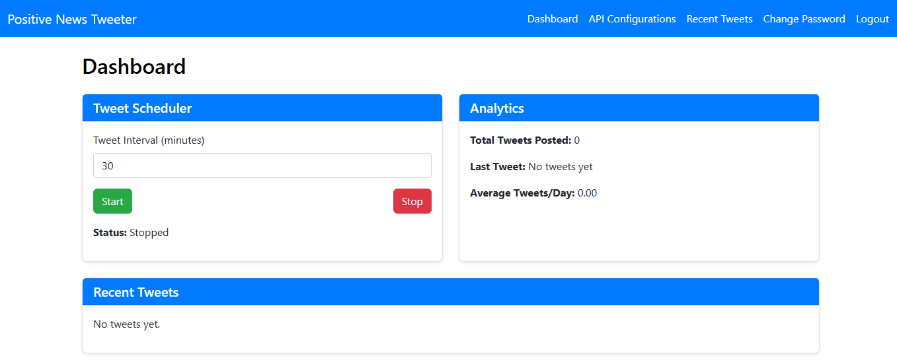
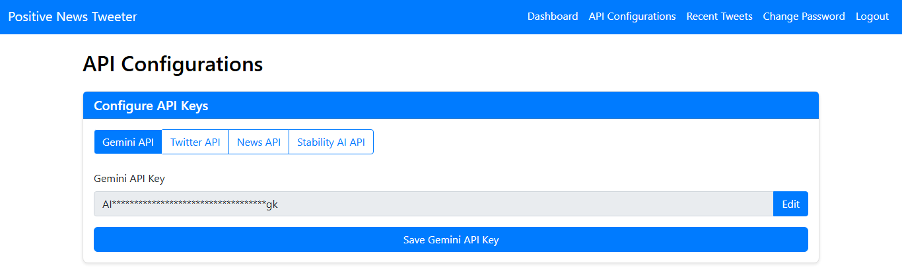
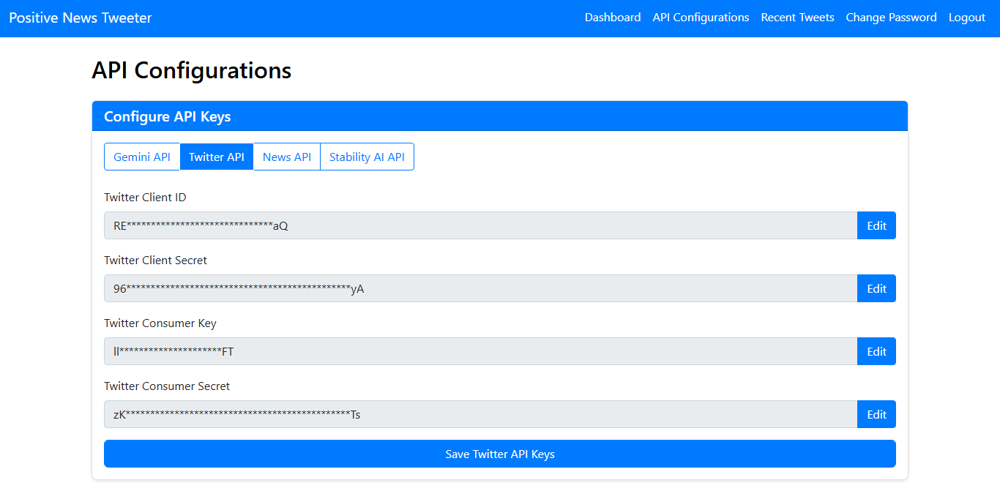
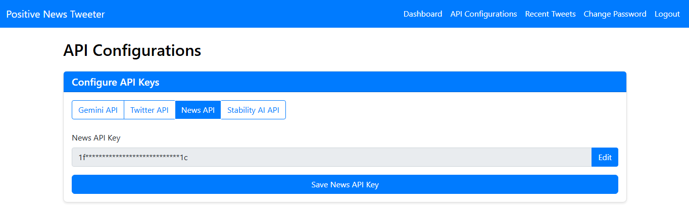
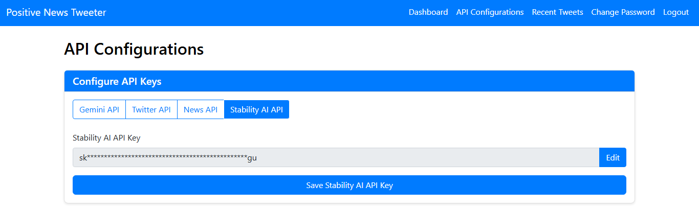

`NewsTweetBot` is a Flask-based web application that automates the process of fetching trending news, generating SEO-optimized tweets with AI-generated images, and posting them to Twitter/X at user-defined intervals. Built with a user-friendly dashboard, secure API configuration, and SQLite database, it ensures non-recurring news and efficient social media automation.

<span style="color: #007bff; font-weight: bold">Explore the live demo.</span>

## Features
- **Automated News Fetching**: Retrieves top U.S. headlines using the [News API](https://newsapi.org/).
- **SEO-Optimized Tweets**: Generates concise tweets with hashtags and shortened URLs for maximum engagement.
- **AI-Generated Images**: Creates custom images for each tweet using the [Stability AI API](https://stability.ai/).
- **Non-Recurring News**: Tracks used articles in a SQLite database to avoid duplicates.
- **User-Friendly Dashboard**: Configures tweet intervals, manages API keys, and displays tweet analytics.
- **Secure API Management**: Supports masked API key display and independent updates for Gemini, Twitter/X, News, and Stability AI APIs.

## Screenshots

### API Configuration

Configure API keys for Gemini.

Configure API keys for Twitter/X.

Configure API keys for News.

Configure API keys for Stability AI with secure.


### Dashboard

Manage tweet scheduling, view recent tweets, and monitor analytics with an intuitive interface.

## Quick Start

Follow these steps to set up and run `NewsTweetBot` locally.

### Prerequisites
- Python 3.8+ (tested with Python 3.12).
- Git installed for cloning the repository.
- API keys for:
  - [News API](https://newsapi.org/) (for news fetching).
  - [Twitter/X API](https://developer.twitter.com/) (for tweet posting).
  - [Stability AI API](https://stability.ai/) (for image generation).
  - [Gemini API](https://ai.google.dev/) (optional, for future features).

### Installation

1. **Clone the Repository**:
   ```sh
   git clone https://github.com/yaseen002/NewsTweetBot.git
   cd NewsTweetBot
   ```

2. **Create a Virtual Environment**:
   ```sh
   python -m venv venv
   .\venv\Scripts\activate  # Windows
   # source venv/bin/activate  # macOS/Linux
   ```

3. **Install Dependencies**:
   ```sh
   pip install -r requirements.txt
   ```

4. **Run the Application**:
   ```sh
   python app.py
   ```
   - This creates the SQLite database (`instance/app.db`) automatically.
   - Access the app at `http://localhost:5000`.

5. **Create a Default User**:
   ```sh
   python create_user.py
   ```
   - Creates a user with:
     - Username: `admin`
     - Password: `admin123`

6. **Configure API Keys**:
   - Log in at `http://localhost:5000` with `admin`/`admin123`.
   - Navigate to `/configs` and add the following API keys:
     - **Gemini API Key**: For future AI features (optional). Obtain from [Google AI Studio](https://ai.google.dev/).
     - **Twitter/X API Keys**:
       - `Client ID` and `Client Secret`: For OAuth (optional, not used in current posting).
       - `Consumer Key` and `Consumer Secret`: For tweet posting. Obtain from [Twitter Developer Portal](https://developer.twitter.com/).
       - Ensure your Twitter app has **read/write permissions** and is linked to a project with API access.
     - **News API Key**: For fetching headlines. Obtain from [News API](https://newsapi.org/).
     - **Stability AI API Key**: For generating tweet images. Obtain from [Stability AI](https://stability.ai/).
   - Click “Save” for each API form. Keys are masked (e.g., `sk************ey`) for security.

7. **Start Tweeting**:
   - Go to `/dashboard`.
   - Set a tweet interval (e.g., 30 minutes).
   - Click “Start” to begin automated tweeting.
   - Monitor tweets at `/tweets` or on your Twitter/X account.

> [!NOTE]
> Ensure your Twitter/X app has write permissions, and verify API keys before starting the scheduler. Rate limits apply: News API (100 requests/day free tier), Stability AI (varies by plan).

## Project Structure

```
NewsTweetBot/
├── instance/
│   └── app.db              # SQLite database
├── static/
│   ├── css/
│   │   └── styles.css      # CSS styles
│   └── images/             # Temporary AI-generated images
├── templates/
│   ├── base.html           # Base template
│   ├── configs.html        # API configuration page
│   ├── dashboard.html      # Dashboard for scheduling and analytics
│   ├── login.html          # Login page
│   ├── tweets.html         # Tweet history page
│   └── change_password.html # Password change page
├── app.py                  # Main Flask application
├── config.py               # Configuration settings
├── create_user.py          # Script to create default user
├── image_gen.py            # Stability AI image generation
├── models.py               # Database models
├── tweet_scheduler.py      # Tweet scheduling logic
├── requirements.txt        # Python dependencies
├── README.md               # This file
└── LICENSE                 # MIT License
```

## API Configuration Details

- **Gemini API**:
  - **Purpose**: Reserved for future AI-driven features (e.g., tweet content enhancement).
  - **How to Obtain**: Sign up at [Google AI Studio](https://ai.google.dev/), generate an API key, and paste it in `/configs`.
  - **Note**: Optional for current functionality.

- **Twitter/X API**:
  - **Purpose**: Posts tweets with AI-generated images.
  - **Keys Needed**:
    - `Consumer Key` and `Consumer Secret`: For OAuth 1.0a authentication.
    - `Client ID` and `Client Secret`: For OAuth 2.0 (not used in current posting but stored for future use).
  - **How to Obtain**:
    1. Create a Twitter Developer account at [developer.twitter.com](https://developer.twitter.com/).
    2. Create a project and app in the Developer Portal.
    3. Enable read/write permissions for the app.
    4. Generate and copy the keys to `/configs`.
  - **Note**: Ensure the app is linked to a project with API access (free tier supports basic posting).

- **News API**:
  - **Purpose**: Fetches top U.S. headlines for tweets.
  - **How to Obtain**:
    1. Sign up at [newsapi.org](https://newsapi.org/).
    2. Generate an API key and paste it in `/configs`.
  - **Note**: Free tier allows 100 requests/day; monitor usage for frequent scheduling.

- **Stability AI API**:
  - **Purpose**: Generates images for tweets based on news titles.
  - **How to Obtain**:
    1. Sign up at [stability.ai](https://stability.ai/).
    2. Generate an API key (starts with `sk-`) and paste it in `/configs`.
  - **Note**: Pricing varies; ensure sufficient credits for image generation.

## Troubleshooting

- **Database Not Created**:
  - Check `instance/` permissions:
    ```sh
    icacls D:\0PROJECTS\OTHERS\GITHUB\NewsTweetBot\instance
    ```
  - Verify `config.py` has the correct `SQLALCHEMY_DATABASE_URI`:
    ```python
    SQLALCHEMY_DATABASE_URI = 'sqlite:///D:/0PROJECTS/OTHERS/GITHUB/NewsTweetBot/instance/app.db'
    ```

- **Scheduler Errors**:
  - If no tweets are posted, check console logs for errors (e.g., “Missing API keys”).
  - Test API keys individually:
    ```python
    # News API
    from newsapi import NewsApiClient
    newsapi = NewsApiClient(api_key='YOUR_NEWS_API_KEY')
    print(newsapi.get_top_headlines(country='us'))

    # Stability AI
    from image_gen import generate_image
    generate_image("Test image", "YOUR_STABILITY_API_KEY", "static/images/test.webp")

    # Twitter/X
    import tweepy
    auth = tweepy.OAuthHandler('CONSUMER_KEY', 'CONSUMER_SECRET')
    api = tweepy.API(auth)
    api.update_status("Test tweet")
    ```

- **API Key Issues**:
  - Ensure keys are saved in `/configs`:
    ```sh
    sqlite3 instance\app.db "SELECT * FROM api_keys;"
    ```
  - Verify Twitter/X app permissions and News/Stability AI rate limits.

## License

The code in this repository is licensed under the [MIT License](./LICENSE).
